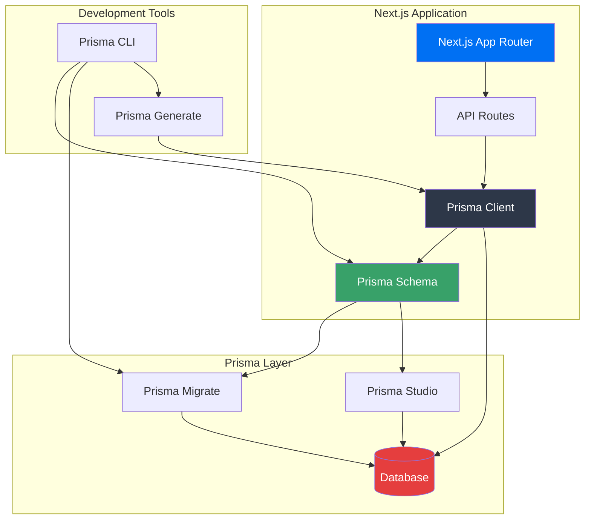

# Prisma Tutorial - Next.js & Prisma ORM

A comprehensive tutorial project demonstrating Prisma ORM architecture and integration with Next.js. Perfect for computer science students learning modern web development!

## 📚 Table of Contents

- [What is Prisma?](#what-is-prisma)
- [Architecture Overview](#architecture-overview)
- [Project Structure](#project-structure)
- [Key Components Explained](#key-components-explained)
- [Getting Started](#getting-started)
- [Common Prisma Operations](#common-prisma-operations)
- [Next Steps](#next-steps)

## What is Prisma?

Prisma is a **next-generation Object-Relational Mapping (ORM)** tool that makes database access easy and type-safe. Think of it as a bridge between your application code and your database.

### Why Use Prisma?

- ✅ **Type Safety**: Automatically generates TypeScript types based on your database schema
- ✅ **Developer Experience**: Intuitive API that's easy to learn
- ✅ **Database Agnostic**: Works with PostgreSQL, MySQL, SQLite, and more
- ✅ **Migration Management**: Handles database schema changes automatically
- ✅ **Query Optimization**: Efficient database queries out of the box

## Architecture Overview

The following diagram illustrates how Prisma fits into a Next.js application:



### Component Flow Explanation

1. **Next.js App Router** → Your application's entry point
2. **API Routes** → Handle HTTP requests (GET, POST, etc.)
3. **Prisma Client** → Generated TypeScript client for database operations
4. **Prisma Schema** → Defines your database structure (models, relations)
5. **Prisma Migrate** → Manages database schema changes
6. **Prisma Studio** → Visual database browser
7. **Database** → Your actual data storage (SQLite in this project)

## Project Structure

```
PrismaTutorial/
├── app/                    # Next.js App Router directory
│   ├── api/               # API routes
│   │   ├── users/         # User endpoints
│   │   └── posts/         # Post endpoints
│   ├── layout.tsx         # Root layout
│   ├── page.tsx           # Home page
│   └── globals.css        # Global styles
├── lib/
│   └── prisma.ts          # Prisma Client singleton
├── prisma/
│   └── schema.prisma      # Database schema definition
├── package.json           # Dependencies and scripts
├── tsconfig.json          # TypeScript configuration
└── README.md             # This file!
```

## Key Components Explained

### 1. Prisma Schema (`prisma/schema.prisma`)

The schema file is the **single source of truth** for your database structure. It defines:

- **Models**: Represent database tables
- **Fields**: Represent table columns
- **Relations**: Define relationships between models
- **Generators**: Configure code generation
- **Data Sources**: Database connection settings

**Example from this project:**

```prisma
model User {
  id        Int      @id @default(autoincrement())
  email     String   @unique
  name      String?
  createdAt DateTime @default(now())
  updatedAt DateTime @updatedAt
  posts     Post[]   // One-to-many relation
}

model Post {
  id        Int      @id @default(autoincrement())
  title     String
  content   String?
  published Boolean  @default(false)
  authorId  Int
  author    User     @relation(fields: [authorId], references: [id])
  createdAt DateTime @default(now())
  updatedAt DateTime @updatedAt
}
```

**Key Concepts:**
- `@id`: Primary key
- `@default(autoincrement())`: Auto-incrementing integer
- `@unique`: Ensures no duplicate values
- `@relation`: Defines relationships between models
- `?`: Makes a field optional

### 2. Prisma Client (`lib/prisma.ts`)

Prisma Client is the **generated TypeScript client** that provides type-safe database access. It's created by running `prisma generate`.

**Why a singleton pattern?**
- Prevents multiple database connections in development
- Ensures efficient connection pooling
- Avoids "too many connections" errors

### 3. API Routes (`app/api/`)

Next.js API routes handle HTTP requests. They use Prisma Client to interact with the database.

**Example:**
```typescript
// GET /api/users
export async function GET() {
  const users = await prisma.user.findMany({
    include: { posts: true } // Include related posts
  })
  return NextResponse.json(users)
}
```

## Getting Started

### Prerequisites

- Node.js 18+ (20+ recommended)
- npm or yarn

### Installation Steps

1. **Install dependencies:**
   ```bash
   npm install
   ```

2. **Generate Prisma Client:**
   ```bash
   npm run db:generate
   ```
   This reads your schema and generates TypeScript types.

3. **Create the database:**
   ```bash
   npm run db:push
   ```
   This creates the database file and tables based on your schema.

4. **Start the development server:**
   ```bash
   npm run dev
   ```

5. **Open your browser:**
   Navigate to `http://localhost:3000`

### Available Scripts

- `npm run dev` - Start development server
- `npm run build` - Build for production
- `npm run start` - Start production server
- `npm run db:generate` - Generate Prisma Client
- `npm run db:push` - Push schema changes to database
- `npm run db:migrate` - Create a migration
- `npm run db:studio` - Open Prisma Studio (visual database browser)

## Common Prisma Operations

### Create (INSERT)

```typescript
// Create a user
const user = await prisma.user.create({
  data: {
    email: "student@example.com",
    name: "CS Student"
  }
})

// Create a post with relation
const post = await prisma.post.create({
  data: {
    title: "My First Post",
    content: "Learning Prisma!",
    authorId: user.id
  }
})
```

### Read (SELECT)

```typescript
// Find all users
const users = await prisma.user.findMany()

// Find one user
const user = await prisma.user.findUnique({
  where: { email: "student@example.com" }
})

// Find with relations
const userWithPosts = await prisma.user.findUnique({
  where: { id: 1 },
  include: { posts: true }
})
```

### Update (UPDATE)

```typescript
// Update a user
const updatedUser = await prisma.user.update({
  where: { id: 1 },
  data: { name: "Updated Name" }
})
```

### Delete (DELETE)

```typescript
// Delete a user
await prisma.user.delete({
  where: { id: 1 }
})
```

## Understanding the Architecture Diagram

### Data Flow

1. **Request comes in** → Next.js API route receives HTTP request
2. **Prisma Client called** → API route uses Prisma Client methods
3. **Query executed** → Prisma translates TypeScript to SQL
4. **Database responds** → Results returned as TypeScript objects
5. **Response sent** → JSON response sent back to client

### Development Workflow

1. **Modify Schema** → Edit `prisma/schema.prisma`
2. **Generate Client** → Run `prisma generate`
3. **Update Database** → Run `prisma db push` or `prisma migrate dev`
4. **Use in Code** → Import Prisma Client and use type-safe queries

## Next Steps

### Learning Path

1. ✅ **Understand the schema** - Study `prisma/schema.prisma`
2. ✅ **Explore API routes** - Check `app/api/users/route.ts` and `app/api/posts/route.ts`
3. 🔄 **Try Prisma Studio** - Run `npm run db:studio` to visually explore your database
4. 🔄 **Add new models** - Create a `Comment` model related to `Post`
5. 🔄 **Experiment with queries** - Try filtering, sorting, and pagination
6. 🔄 **Learn migrations** - Use `prisma migrate dev` for production-ready changes

### Recommended Resources

- [Prisma Documentation](https://www.prisma.io/docs)
- [Next.js Documentation](https://nextjs.org/docs)
- [Prisma Learn](https://www.prisma.io/learn) - Interactive tutorials

## Key Takeaways for CS Students

1. **ORM Benefits**: Prisma abstracts SQL, making database operations easier and safer
2. **Type Safety**: TypeScript + Prisma = Catch errors before runtime
3. **Schema as Code**: Your database structure is version-controlled
4. **Relations**: Understand one-to-many, many-to-many relationships
5. **Migrations**: Database changes are tracked and reversible

## Troubleshooting

### "Prisma Client not generated"
Run `npm run db:generate`

### "Database not found"
Run `npm run db:push` to create the database

### "Cannot find module '@prisma/client'"
Make sure you've run `npm install` and `npm run db:generate`

---

Happy coding! 🚀

# prisma-tutorial
